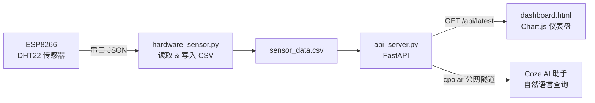

# 🌱 智能环境哨兵 · Smart Environment Guardian

> 一个从硬件采集到 AI 语音助手的全链路 IoT 环境监测系统。
> 
> **传感器 → 串口 → CSV → FastAPI → 仪表盘 → Coze AI 助手**

---

## ✨ 核心特性

- 🔌 **真实硬件采集**：ESP8266 + DHT22 每 5 秒读取真实温湿度，替代随机数模拟
- 📊 **双 Y 轴实时仪表盘**：原生 JS + Chart.js 打造，20 条历史趋势折线图，卡片动态变色，异常数据闪烁提醒
- 🧠 **智能体感诊断**：温度 + 湿度 → 体感舒适度计算，中文健康提示
- 🤖 **AI 语音助手**：Coze Bot 支持自然语言查询"现在环境怎么样"，实时调取真实数据
- ⚡ **数据持久化**：CSV 格式存储，支持冷热备份与后续分析

---

## 🏗️ 系统架构



## 🛠️ 技术栈

| 层级 | 技术 | 文件 |
|------|------|------|
| 嵌入式固件 | C语言 · Arduino IDE · DHT22 | firmware/dht22_test.ino |
| 数据采集 | Python · pyserial · JSON | hardware_sensor.py |
| 后端 API | Python · FastAPI · CORS | api_server.py |
| 前端仪表盘 | HTML5 · CSS3 · JavaScript · Chart.js | dashboard.html |
| AI 助手 | Coze · cpolar 内网穿透 · 工作流 | https://www.coze.cn/... |
| 版本管理 | Git · GitHub | 本仓库 |

## 🔌 硬件清单

| 硬件 | 型号 | 单价 | 连接引脚 |
|------|------|------|----------|
| 主控板 | NodeMCU ESP8266 (红板) | ≈¥15 | Micro-USB 供电 |
| 温湿度传感器 | DHT22 (AM2302) | ≈¥8 | DATA → D4 |
| 连接线 | 母对母杜邦线 ×3 | ≈¥2 | VCC→3V3, GND→GND |

📌 **接线图**：VCC → 3V3 | DATA → D4 (GPIO2) | GND → GND

---

## 🚀 快速开始

### 1. 硬件固件

用 Arduino IDE 打开 `firmware/dht22_test.ino`

选择开发板：NodeMCU 1.0 (ESP-12E Module)

安装库：DHT sensor library by Adafruit

烧录固件 → 打开串口监视器（115200 bps）确认 JSON 输出

### 2. 数据采集

```bash
cd smart-environment-guardian
python hardware_sensor.py
# 每 5 秒输出：[2026-05-07 15:07:25] 已记录真实数据 → 温度:24.8°C 湿度:66.7%
```

### 3. 后端 API

```bash
python api_server.py
# 浏览器访问 http://localhost:8000/api/latest → {"temp":24.8,"humi":66.7}
```

### 4. 前端仪表盘

```bash
python -m http.server 5500
# 浏览器访问 http://localhost:5500/dashboard.html
```

### 5. AI 助手

启动 cpolar 隧道：`cpolar http 8000`

更新 Coze 工作流 URL → 发布 Bot

自然语言问"现在环境怎么样"

---

## 📁 项目结构

```text
smart-environment-guardian/
├── firmware/                  # 嵌入式 C 语言固件
│   └── dht22_test.ino         # ESP8266 + DHT22 串口 JSON 输出
├── hardware_sensor.py         # 真实硬件数据采集（替换虚拟传感器）
├── read_serial.py             # 串口测试脚本
├── virtual_sensor.py          # 虚拟传感器（历史版本，保留为演进记录）
├── data_receiver.py           # 早期管道接收器（已被 hardware_sensor.py 替代）
├── api_server.py              # FastAPI 后端，提供 /api/latest 接口
├── dashboard.html             # 前端仪表盘（双Y轴折线图 + 体感诊断 + AI 入口）
├── sensor_data.csv            # 温湿度历史数据
└── README.md                  # 本文件
```

## 📸 演示截图

[仪表盘]


[Coze AI 助手]


---

## 📄 开源协议

MIT License · 欢迎 Star、Fork 和 PR

## 👤 关于作者

GitHub：[step997](https://github.com/step997)

主攻方向：嵌入式 IoT × AI 交叉 · 全栈开发

项目状态：已完成全链路闭环，持续迭代中
